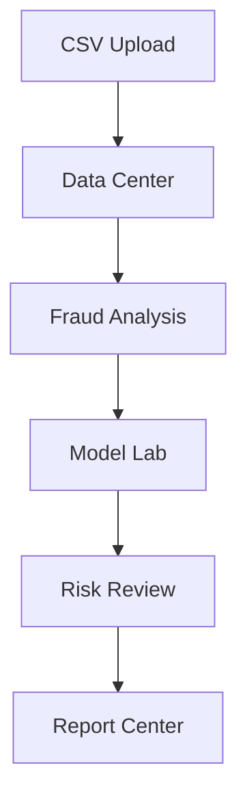

# FraudShield AI

FraudShield AI is a transaction fraud detection and risk-intelligence application built with Python, Streamlit, scikit-learn, SHAP, Plotly, and ReportLab. It covers the complete portfolio workflow from CSV validation to explainable investigation queues and executive reporting.

The application is decision support. It never automatically blocks transactions and never treats a model score as proof of fraud.

## Features

- Validated CSV upload with encoding and delimiter detection
- Data preview, schema inspection, and quality scoring
- Reversible cleaning with a complete action summary
- Fraud class, amount, category, time, and correlation analysis
- Leakage-safe preprocessing and model pipelines
- Logistic Regression, Random Forest, and Extra Trees comparison
- Stratified holdout and optional stratified cross-validation
- Precision, recall, F1, PR-AUC, ROC-AUC, and confusion matrix
- Interactive threshold analysis
- Transparent 0-100 risk scores and investigation bands
- Filterable manual-review queue and scored CSV export
- Exact logistic and Tree SHAP local explanations
- Privacy-conscious executive PDF reporting
- Docker, Render, Streamlit Cloud, and GitHub CI support

## Architecture



| Layer | Responsibility |
|---|---|
| Data | Validation, profiling, cleaning, and session state |
| Analysis | Label-aware fraud EDA and correlation insights |
| Modeling | Feature safety, pipelines, training, metrics, and artifacts |
| Risk | Batch scores, bands, queue decisions, and local explanations |
| Reporting | Executive PDF generation without raw transaction fields |
| Interface | Streamlit pages and interactive Plotly charts |

## Project Structure

```text
fraudshield-ai/
|-- app.py
|-- config/settings.toml
|-- data/
|-- docs/
|-- examples/sample_transactions.csv
|-- models/
|-- output/pdf/
|-- reports/
|-- src/fraudshield/
|   |-- analysis/
|   |-- data/
|   |-- modeling/
|   |-- pages/
|   |-- reporting/
|   |-- risk/
|   `-- state.py
|-- tests/
|-- Dockerfile
|-- docker-compose.yml
|-- render.yaml
|-- requirements.txt
`-- requirements-dev.txt
```

## Windows Setup

Open PowerShell inside the project folder:

```powershell
py -m venv .venv
.venv\Scripts\Activate.ps1
python -m pip install --upgrade pip
pip install -r requirements-dev.txt
pytest
streamlit run app.py
```

If PowerShell blocks activation, use Command Prompt:

```bat
py -m venv .venv
.venv\Scripts\activate.bat
pip install -r requirements-dev.txt
pytest
streamlit run app.py
```

Open `http://localhost:8501`.

## Linux or macOS Setup

```bash
python3 -m venv .venv
source .venv/bin/activate
python -m pip install --upgrade pip
pip install -r requirements-dev.txt
pytest
streamlit run app.py
```

## Demo Workflow

1. Open **Data Center** and upload `examples/sample_transactions.csv`.
2. Review missing values, duplicates, schema, and quality score.
3. Run cleaning and keep the original available for restoration.
4. Open **Fraud Analysis** and confirm the suggested target, fraud label, amount, and time columns.
5. Open **Model Lab** and train one or more candidate models.
6. Review holdout metrics, curves, confusion matrix, and threshold trade-offs.
7. Open **Risk Review**, score the active dataset, and filter the investigation queue.
8. Generate a local explanation for one transaction.
9. Open **Report Center** and download the executive PDF.

The included dataset has only 15 rows and intentionally contains missing and duplicate data. It validates the workflow but cannot support meaningful model-performance claims.

## Verification

```bash
pytest
ruff check .
python -m compileall -q app.py src tests
```

GitHub Actions runs lint and tests for every push and pull request.

## Deployment

Docker:

```bash
docker compose up --build
```

For Streamlit Community Cloud and Render steps, see `docs/deployment.md`.

Free demo hosting has CPU, memory, sleep, and local-storage limits. Disable cross-validation or train fewer models if the instance is constrained.

## Documentation

- `docs/architecture.md`
- `docs/data_center.md`
- `docs/fraud_analysis.md`
- `docs/model_lab.md`
- `docs/risk_review.md`
- `docs/deployment.md`
- `docs/testing.md`
- `docs/presentation_outline.md`
- `docs/viva_qa.md`
- `docs/final_checklist.md`

## Safety and Limitations

- No automatic blocking or customer penalty
- No guaranteed fraud-detection claims
- Human review required for every customer-impacting action
- Raw transactions excluded from executive PDFs
- Model artifacts loaded only from trusted sources
- Public demo unsuitable for real customer or regulated financial data
- Production use requires authentication, encryption, audit logs, durable storage, drift monitoring, case management, privacy review, and incident response

## License

This portfolio project does not include a commercial license. Add an approved license before redistribution or production use.

