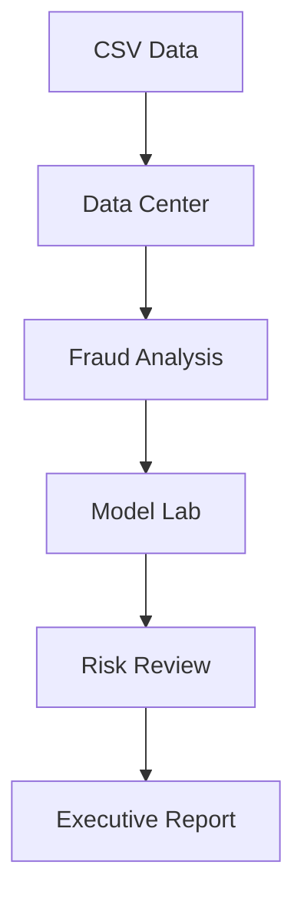

# FraudShield AI - 20-Slide Presentation

## Slide 1 - Title

**FraudShield AI: Transaction Fraud Detection and Risk Intelligence**

Mitesh Nehra | B.Tech AI | Project Demo

Speaker point: FraudShield AI converts labeled transaction data into explainable risk signals for human investigation.

## Slide 2 - Problem Statement

- Digital transaction volume makes manual review impossible at scale.
- Fraud is rare, adaptive, and expensive.
- Simple rules create false alerts and miss new patterns.

Speaker point: The problem is not only predicting fraud; it is prioritizing limited investigation capacity safely.

## Slide 3 - Project Objectives

- Validate and clean transaction datasets.
- Discover fraud patterns.
- Train leakage-safe classifiers.
- Compare models with fraud-appropriate metrics.
- Produce explainable risk scores and reports.

## Slide 4 - Scope and Safety Boundary

- Decision support, not automatic blocking.
- Human review remains mandatory.
- Portfolio/demo deployment only.
- No real customer data in public demos.

## Slide 5 - System Architecture

## Slide 6 - Technology Stack

- Python, Pandas, NumPy
- Scikit-learn
- Streamlit and Plotly
- SHAP
- ReportLab
- Pytest, Ruff, Docker, GitHub Actions

## Slide 7 - Data Center

- CSV extension, size, encoding, and delimiter validation
- Preview and schema inspection
- Missing, duplicate, empty, and constant-column checks
- In-session processing for privacy

## Slide 8 - Reversible Data Cleaning

- Blank-text normalization
- Whitespace trimming
- Empty-row and column removal
- Duplicate removal
- Optional numeric and categorical imputation
- Original dataset remains restorable

## Slide 9 - Fraud Exploratory Analysis

- Class balance and fraud rate
- Fraud-linked amount exposure
- Category risk comparison
- Time and hour-of-day trends
- Spearman correlation analysis

## Slide 10 - Feature Safety

- Target excluded from model inputs
- High-cardinality IDs excluded by default
- Constant and empty columns removed
- Timestamps converted to hour, weekday, month, and weekend features

## Slide 11 - Leakage Prevention

- Stratified split happens before fitting preprocessing.
- Imputers, scaler, and encoder live inside sklearn pipelines.
- Cross-validation refits the whole pipeline in each fold.
- Holdout is untouched until final evaluation.

## Slide 12 - Candidate Models

- Logistic Regression: interpretable linear baseline
- Random Forest: nonlinear bagged trees
- Extra Trees: randomized tree ensemble
- Balanced class weights handle rare fraud without SMOTE leakage

## Slide 13 - Evaluation Metrics

- Precision: quality of fraud alerts
- Recall: fraction of fraud caught
- F1: precision-recall balance
- PR-AUC: ranking quality for imbalanced fraud data
- ROC-AUC and confusion matrix as supporting metrics

## Slide 14 - Threshold Engineering

- Model probability is not the final operating decision.
- Lower threshold increases recall and false alerts.
- Higher threshold increases precision and missed fraud.
- Threshold must match investigation capacity and fraud cost.

## Slide 15 - Risk Intelligence

- Risk score equals fraud probability multiplied by 100.
- Low: 0-29
- Medium: 30-59
- High: 60-79
- Critical: 80-100

## Slide 16 - Explainable AI

- Logistic Regression uses exact signed local contributions.
- Tree models use Tree SHAP.
- Positive features raise the model signal.
- Negative features lower the signal.
- Explanation is model behavior, not proof of causation.

## Slide 17 - Executive Reporting

- Dataset quality summary
- Labeled fraud profile
- Model leaderboard
- Investigation queue distribution
- Governance and production-readiness checklist
- Raw transaction fields excluded for privacy

## Slide 18 - Testing and Reliability

- Unit and integration tests
- Static compilation and style checks
- PDF text and page validation
- Visual PDF rendering review
- GitHub Actions CI

## Slide 19 - Limitations and Future Work

- Demo sample is too small for performance claims.
- Public app has no authentication or durable audit store.
- Production needs time-based validation, drift monitoring, calibration, model registry, and case management.

## Slide 20 - Conclusion

FraudShield AI demonstrates the complete responsible ML workflow: data validation, analysis, leakage-safe modeling, threshold selection, explainability, investigation prioritization, and governance-aware reporting.

Closing line: The goal is not to replace investigators; it is to help them review the right transactions first.

